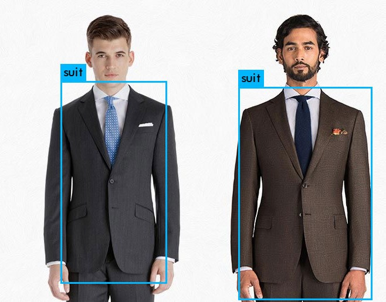
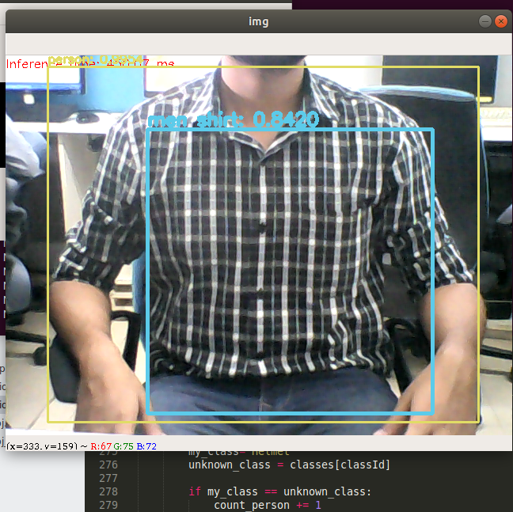

# Real-time-clothes-detection
Detection of 7 multiple classes of fashion dresses in realtime

Transfer Learning using the Darknet network and model architecture used is YOLO_v3

Training done using the yolo_tiny .cfg file

Weights file can be downloaded from the link:(https://drive.google.com/open?id=175uX_5y1D4RvWB2HDjkAa-Q-xdTlPISp)

Screenshots of predictions:

